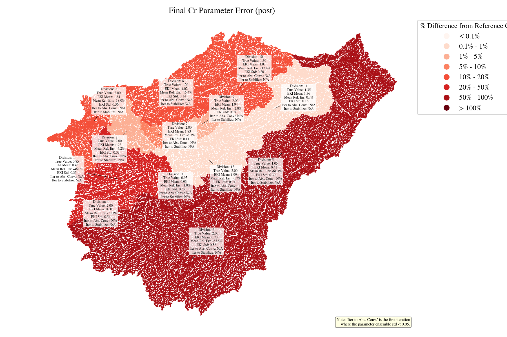
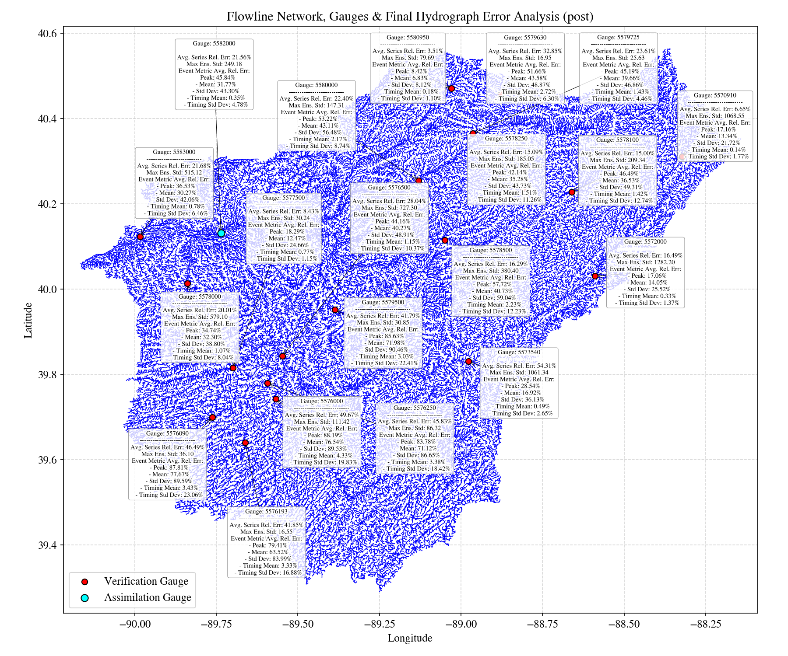
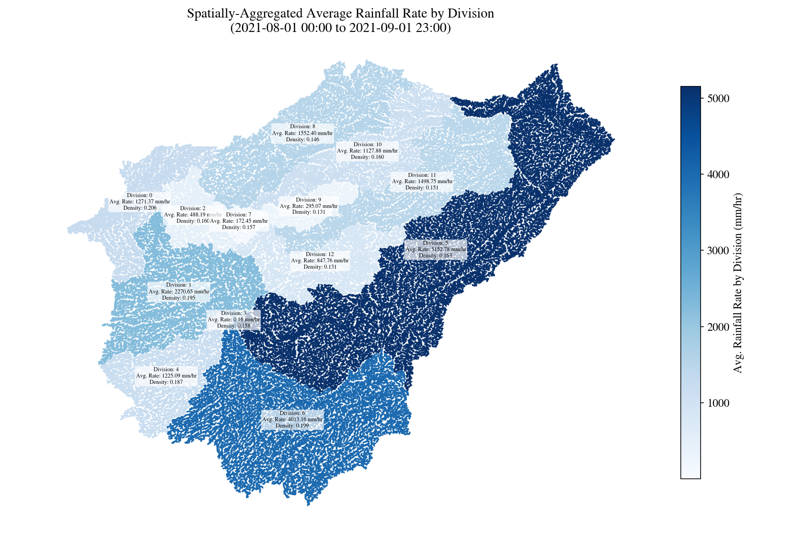
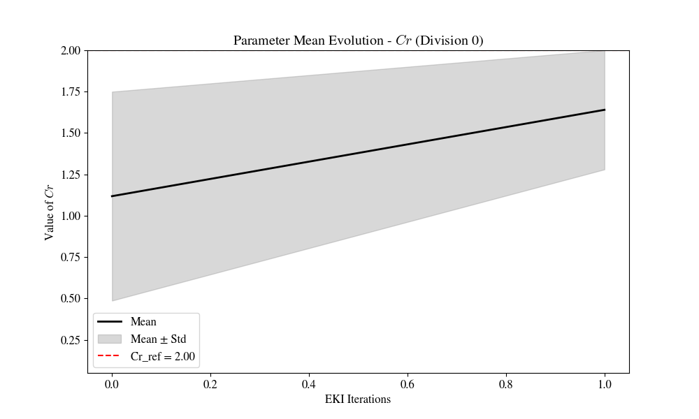

# Hydrology_EKI

Hydrology_EKI is a research codebase for calibrating distributed hydrologic
model parameters with Ensemble Kalman Inversion (EKI). The current workflow
focuses on the Sangamon River basin and estimates runoff coefficient (`Cr`)
parameters by assimilating simulated or observed streamflow data.

The repository is intended to contain source code, configuration templates,
small model-structure inputs, and a few representative results. Large forcing
datasets and regenerated experiment outputs are kept outside Git.

## Highlights

- Ensemble Kalman Inversion workflow for hydrologic parameter calibration.
- Support for simulated experiments and real USGS streamflow observations.
- Event-based and time-series observation operators.
- Spatial visualizations for calibrated parameters, rainfall forcing, and
  hydrograph performance.

## Repository Layout

```text
Inverse_Problem/        EKI workflow, model I/O, metrics, and visualization code
Inverse_Problem/hlm_data/
                        Small model-structure files and parameter templates
examples/results/       A small set of representative result figures
sangamon/               Sangamon basin GIS files and mapping notebooks
environment.yml         Conda environment for the Python workflow
```

Generated outputs are written to `Inverse_Problem/out/` and scratch files to
`Inverse_Problem/tmp/`. These directories are ignored by Git.

## Environment

Create the conda environment from the repository root:

```bash
conda env create -f environment.yml
conda activate hydrology-eki
```

The workflow also requires access to the hydrologic model executable used by
the project. Configure local paths in `Inverse_Problem/config.j2` before
running an experiment.

## Data

Large forcing and auxiliary data should be distributed through GitHub Releases
instead of being committed to the repository. Download the latest data archive
from:

```text
https://github.com/Zhihua-Lee/Hydrology_EKI/releases
```

Extract the archive at the repository root so that paths such as the following
are restored:

```text
Inverse_Problem/hlm_data/Simulated_data/Rainfall_Sangamon_river/
sangamon/usgs-basins.geojson
```

Small structure files and parameter templates remain in
`Inverse_Problem/hlm_data/` because they document the model setup and are useful
for understanding the code.

## Running An Experiment

Edit `Inverse_Problem/config.j2` to choose the experiment type, gauges, time
window, ensemble size, and local model paths. Then run:

```bash
cd Inverse_Problem
bash main.sh
```

To regenerate visualizations from an existing output directory:

```bash
cd Inverse_Problem
VISUALIZE_ONLY=true bash main.sh
```

The Python entry point can also be called directly:

```bash
python eki_test.py config.j2
python eki_test.py config.j2 --visualize-only
```

## Example Results

Representative Sangamon experiment outputs are kept in `examples/results/`.
They are included only as lightweight project illustrations; full experiment
outputs should be regenerated locally or published as release assets.









## Notes For Contributors

- Keep generated outputs, scratch files, archives, and large forcing data out
  of Git.
- Put small, curated result figures in `examples/results/` when they help
  explain the project.
- Publish large reproducibility assets through GitHub Releases or a dedicated
  data-management tool.
